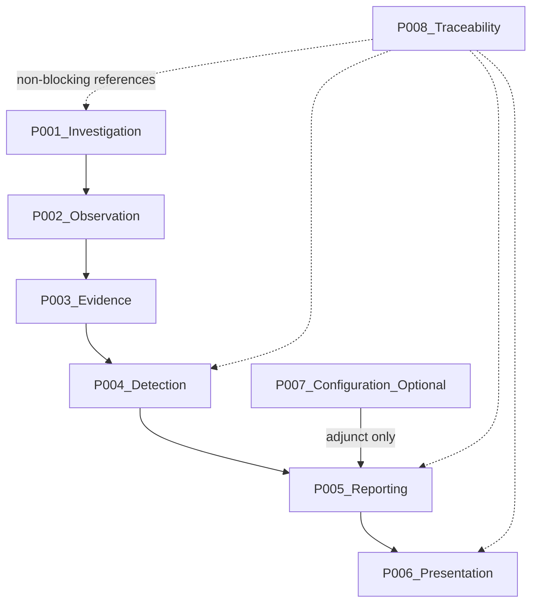

# 03 — Package Build Order

**Status:** Active — Implementation Phase  
**Document type:** Package implementation sequencing (when packages are built—not how)  
**Depends on:** [`00_IMPLEMENTATION_PLAN.md`](00_IMPLEMENTATION_PLAN.md); [`01_REPOSITORY_STRUCTURE.md`](01_REPOSITORY_STRUCTURE.md); [`02_CODING_STANDARDS.md`](02_CODING_STANDARDS.md); frozen `architecture/00`–`13`; ADR-001–ADR-006

This document defines **when** each approved logical package is implemented. It does not redesign packages, define APIs, interfaces, algorithms, or implementation logic.

---

## 1. Purpose

Establish a single, dependency-respecting implementation sequence for logical packages `P-001`–`P-008` so that:

- Packages are built in architectural dependency order  
- Prerequisites and completion criteria are explicit before moving downstream  
- Integration checkpoints align with milestones in [`00_IMPLEMENTATION_PLAN`](00_IMPLEMENTATION_PLAN.md)  
- Completed package ownership is protected by a package freeze policy  

---

## 2. Scope

### In scope

- Implementation dependency philosophy  
- Ordered sequence for Investigation → Observation → Evidence → Detection → Reporting → Presentation  
- Placement of optional Configuration and non-blocking Traceability  
- Prerequisites, completion criteria, integration checkpoints, milestone alignment, package freeze  

### Out of scope

- How packages are implemented (code, APIs, interfaces, algorithms)  
- Browser API inventories or Chrome Extension messaging design  
- Redesign of Package Architecture, Pipeline stages, or ADR decisions  
- Closing Open Unknowns by invention  
- Treating `extension/` hosting as a new logical package (it is integration wiring)

---

## 3. Relationship to Architecture

| Authority | Role for build order |
|---|---|
| Package Architecture (`P-*`) | Ownership and allowed collaboration graph |
| Investigation Pipeline (`S-*`) | Stage progression that the sequence realizes |
| Data Flow (`IO-*`) | Producer/consumer order of information objects |
| Extension Architecture (`RR-*`) | Runtime hosting after packages exist—not a separate package in this sequence |
| ADR-001–ADR-006 | Gates for “complete enough” at each package |
| Implementation Plan M1–M9 | Milestone alignment |
| Repository Structure | Physical homes under `src/<package>/` |
| Coding Standards | Import direction that implementation must preserve |

Build order realizes approved dependencies. It does not invent new ones.

---

## 4. Build Order Philosophy

Derived from Package Architecture and Investigation Pipeline—not convenience:

| Principle | Meaning |
|---|---|
| **Architecture-first sequence** | Implement along Investigation → Observation → Evidence → Detection → Reporting → Presentation |
| **Bottom-up readiness** | A downstream package starts only when its upstream prerequisites are met |
| **One package focus at a time** | Finish and checkpoint a package before expanding ownership downstream |
| **Test continuously** | Each package step includes verification appropriate to its ownership (see Testing Strategy / Plan checkpoints) |
| **Never bypass boundaries** | Do not implement Presentation against live Evidence, or Detection that rewrites Evidence |
| **Optional last among consumers** | Configuration is adjunct to Reporting and never blocks the core chain |
| **Traceability non-blocking** | Traceability references outputs; it does not gate core package completion |
| **Hosting after ownership** | `extension/` wires runtime roles after Presentation exists for the core path (M7) |
| **Preserve ADRs** | Completion criteria include ADR compliance, not just “compiles” |

---

## 5. Package Dependency Graph

Approved collaboration (restated—not redesigned):

**Forbidden directions remain forbidden:** Presentation ↛ Detection/Evidence; Reporting ↛ Evidence recollection; Detection ↛ required Configuration; Evidence ↛ Presentation/Configuration.

---

## 6. Package Implementation Sequence

| Step | Package | Why it follows the previous |
|---|---|---|
| **1** | **P-001 Investigation** | Establishes the Investigation root, context, and completion-disposition ownership (ADR-001). Everything else is an episode under this unit of work. |
| **2** | **P-002 Observation** | Needs Investigation Context to target one Storefront observation affordance. Cannot observe without a bound Investigation. |
| **3** | **P-003 Evidence** | Needs Observation Affordance to collect and normalize Evidence into the immutable snapshot (ADR-005; ADR-002). |
| **4** | **P-004 Detection** | Must evaluate only Normalized Evidence—never live re-query. Requires the snapshot and definition-driven posture (ADR-003; ADR-004; ADR-006). |
| **5** | **P-005 Reporting** | Assembles one Diagnostic Report from Detection outputs (and later optional Configuration). Must not recollect Evidence. |
| **6** | **P-006 Presentation** | Prepares Presentation-ready View from the Diagnostic Report only. Depends on Reporting completeness/partial honesty—not on Evidence. |
| **7** | **P-007 Configuration (optional)** | Adjunct supplier into Reporting. Implemented only after Reporting exists as consumer; never required for steps 1–6 (EP-011; FR-026). |
| **8** | **P-008 Traceability** | Cross-cutting reference discipline. Formalized once core outputs exist to reference; must not block steps 1–6. |

**Integration wiring (not a package step):** After Presentation (step 6), host and wire runtime roles under `extension/` for the end-to-end core path (milestone M7). Optional Configuration wiring is a separate lane and must not gate that core path.

---

## 7. Package Prerequisites

| Package | Prerequisites before implementation begins |
|---|---|
| **P-001 Investigation** | Foundation readiness (freeze understood; repository regions designated); Domain vocabulary for Investigation/Completion Disposition available |
| **P-002 Observation** | P-001 Investigation Context ownership in place; Storefront-as-target concept bound to one Investigation |
| **P-003 Evidence** | P-002 Observation Affordance available; single-scan / immutability rules understood (ADR-005; ADR-002) |
| **P-004 Detection** | P-003 Normalized Evidence available as immutable input; Detection Strategy + ADR-003/004/006 accepted as gates |
| **P-005 Reporting** | P-004 Detection outputs (Store Information, Detection Result Set, Unknown Qualifications) producible |
| **P-006 Presentation** | P-005 Diagnostic Report assemblable (Completed or Completed Partial); UI section order constraints known |
| **P-007 Configuration** | P-005 Reporting exists; explicit decision to pursue optional bonus; core path already independent |
| **P-008 Traceability** | Core package outputs exist sufficiently to reference; Traceability Matrix remains SoT for obligations |

---

## 8. Integration Checkpoints

Checkpoints occur **after** named packages reach completion criteria—before treating the next major slice as done.

| Checkpoint | After | Focus |
|---|---|---|
| **IC-0 Foundation** | Repo + freeze readiness (pre-P-001 expansion) | Architecture freeze; ownership regions; coding import rules understood |
| **IC-1 Root** | P-001 | One Investigation episode model; disposition hooks exist without Detection leakage |
| **IC-2 Snapshot** | P-003 (via P-002) | Single acquisition → Normalized Evidence; downstream cannot rewrite snapshot (ADR-002/005) |
| **IC-3 Detection honesty** | P-004 | Multi-signal posture; Not Detected / Unknown / Unavailable representable; no required Configuration |
| **IC-4 Report** | P-005 | One Diagnostic Report per Investigation; Unknown Qualifications preserved; no Evidence recollection |
| **IC-5 Presentation** | P-006 | Presentation consumes Report only; section order / neutrality; no evaluation leakage |
| **IC-6 Runtime path** | Extension hosting wired for core packages | End-to-end core Investigation traversal (M7); Configuration not required |
| **IC-7 Optional Configuration** | P-007 (if elected) | Adjunct only; core path still succeeds when Configuration absent or failing |
| **IC-8 Verification / Acceptance** | M8–M9 | Testing Strategy domains; FR-014 empirics; docs; residual Unknowns still Open where required |

---

## 9. Package Completion Criteria

A package is complete for sequencing purposes when ownership and ADR gates hold—not when APIs are invented.

| Package | Completion criteria (summary) |
|---|---|
| **P-001 Investigation** | Owns Investigation Context and Completion Disposition; one Storefront target per episode; does not own Evidence/Detection/Presentation meanings (ADR-001) |
| **P-002 Observation** | Owns Observation Affordance for the bound Investigation; does not evaluate products or normalize Evidence |
| **P-003 Evidence** | Collects and normalizes Evidence; exposes immutable Normalized Evidence to downstream; no product conclusions (ADR-002; ADR-005) |
| **P-004 Detection** | Produces Store Information and Detection Results from Normalized Evidence only; supports Not Detected / Unknown honesty; does not rewrite Evidence; does not require Configuration (ADR-003; ADR-004; ADR-006) |
| **P-005 Reporting** | Assembles Diagnostic Report from Detection outputs; preserves Unknown Qualifications; does not recollect Evidence; core report forms without Configuration |
| **P-006 Presentation** | Produces Presentation-ready View from Report only; preserves core-before-optional section discipline; does not detect or collect |
| **P-007 Configuration** | Optional Product Configuration adjunct to Reporting only; failure/absence cannot fail core Investigation |
| **P-008 Traceability** | Provides non-blocking obligation/reference discipline; does not own Detection, Evidence, or UI |

Import direction and forbidden edges from Coding Standards must hold at each completion.

---

## 10. Milestone Alignment

Mapping to [`00_IMPLEMENTATION_PLAN`](00_IMPLEMENTATION_PLAN.md):

| Milestone / Phase | Package build-order focus |
|---|---|
| **M1 Foundation** / Phase A | IC-0; repository and freeze readiness—no package logic expansion that skips ownership |
| **M2 Core Domain** / Phase B | **P-001 Investigation** (IC-1) |
| **M3 Evidence** / Phase C | **P-002 Observation** then **P-003 Evidence** (IC-2) |
| **M4 Detection** / Phase D | **P-004 Detection** (IC-3) |
| **M5 Reporting** / Phase E | **P-005 Reporting** (IC-4) |
| **M6 Presentation** / Phase F | **P-006 Presentation** (IC-5) |
| **M7 Integration** / Phase G | Extension runtime hosting/wiring for core path (IC-6)—not a new `P-*` |
| **Optional bonus lane** | **P-007 Configuration** only if elected (IC-7); never blocks M2–M7 |
| **Traceability formalization** | **P-008** may proceed in parallel as non-blocking once outputs exist; does not redefine M2–M6 |
| **M8 Verification** / Phase H | IC-8 verification domains across completed packages |
| **M9 Final Acceptance** / Phase I | Full sequence DoD; optional bonus decision recorded separately |

Later milestones must not redefine earlier package ownership.

---

## 11. Package Freeze Policy

1. **Ownership freeze** — Once a package meets completion criteria, its architectural ownership (owns / must-never-own / dependency direction) is not casually rewritten in code or docs.  
2. **Fix forward in place** — Defects are corrected inside the owning package region without inventing reverse dependencies.  
3. **Downstream may not reassign upstream meaning** — e.g., Presentation must not absorb Detection; Reporting must not absorb Evidence collection.  
4. **Architectural change requires a new ADR** — Do not edit ADR-001–ADR-006; do not thaw Package Architecture for convenience.  
5. **Sequence freeze** — Do not reorder the core chain (P-001→P-006) without architectural authority.  
6. **Optional isolation freeze** — Electing P-007 must not retroactively make P-001–P-006 depend on Configuration.  
7. **Integration freeze** — `extension/` wiring changes must preserve package ownership; hosting is not a license to merge packages.  
8. **Unknown freeze** — Package completion must not close `U-001`–`U-010` by invention.

---

## 12. Definition of Done

Package build-order planning (and adherence) is done when:

1. Core packages are implemented in order P-001 → P-002 → P-003 → P-004 → P-005 → P-006.  
2. Each package’s prerequisites were satisfied before work began.  
3. Each package’s completion criteria and relevant integration checkpoint were met before treating the next milestone slice as complete.  
4. Extension hosting integration (IC-6 / M7) preserves ownership and does not invent a new logical package.  
5. P-007, if present, remains optional and non-blocking.  
6. P-008 remains non-blocking and does not gate the core chain.  
7. Import direction and forbidden edges remain intact.  
8. Milestone alignment M1–M9 is respected.  
9. Package freeze policy was not violated.  
10. No APIs/algorithms/architecture redesign were introduced by this sequencing document or by reordering for convenience.

---

## 13. Conclusion

Packages are implemented in the order demanded by approved dependencies: Investigation, Observation, Evidence, Detection, Reporting, Presentation—then optional Configuration, with Traceability non-blocking and extension hosting as integration after Presentation.

This sequence is when—not how. Subsequent implementation documents may detail package-level work items within this order without changing ownership, thawing ADRs, or reversing the dependency graph.

---

**End of Package Build Order.**
