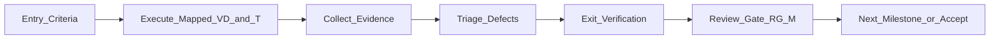

# 05 — Test Execution Plan

**Status:** Active — Implementation Phase  
**Document type:** Test execution planning (how approved verification is run—not a new testing architecture)  
**Depends on:** [`00_IMPLEMENTATION_PLAN.md`](00_IMPLEMENTATION_PLAN.md)–[`04_DEVELOPMENT_MILESTONES.md`](04_DEVELOPMENT_MILESTONES.md); [`architecture/12_TESTING_STRATEGY.md`](../architecture/12_TESTING_STRATEGY.md); frozen architecture `00`–`13`; ADR-001–ADR-006

This document defines **how** the approved Testing Strategy verification domains (`VD-001`–`VD-009`) and implementation checkpoints (`T0`–`T6`) are executed during milestones M1–M9. It does not invent new verification domains, test cases, APIs, algorithms, or implementation logic.

---

## 1. Purpose

Bind Testing Strategy to Development Milestones so that:

- Verification runs continuously in dependency order  
- Milestone review gates (RG-M*) require mapped exit verification  
- ADR and ownership invariants are checked before later stages rely on them  
- Acceptance (M8–M9) reconfirms core-path verification without thawing architecture  

---

## 2. Scope

### In scope

- Test execution philosophy and lifecycle  
- Mapping of `T0`–`T6` to milestones  
- Mapping of `VD-001`–`VD-009` to milestones and package build order  
- Execution sequence, evidence collection, defect workflow, regression policy  
- Milestone exit verification and acceptance verification reporting expectations  

### Out of scope

- New verification domains or new architectural tests  
- Named frameworks, CI pipelines, coverage thresholds, or assertion libraries  
- Browser APIs, implementation code, algorithms, selectors, or confidence formulas  
- Closing Open Unknowns (`U-001`–`U-010`) by treating Open as failure  
- Mandatory verification of optional Configuration as a core blocker (FR-026)

---

## 3. Relationship to Architecture

| Authority | Role in execution |
|---|---|
| `12_TESTING_STRATEGY` | Sole source of verification domains (`VD-*`), flow, principles, invariants |
| Implementation Plan | Defines `T0`–`T6` checkpoint intents |
| Development Milestones | Defines when gates fire (`RG-M1`–`RG-M9`) |
| Package Build Order | Defines IC-* readiness relative to packages |
| Traceability Matrix | Obligation coverage and residual Unknown tracking for VD-001/VD-009 |
| ADR-001–ADR-006 | Invariants preserved under VD-003–VD-008 execution |
| Coding Standards / Repo Structure | Where defects are fixed; tests stay under `tests/` |

Execution applies Testing Strategy. It does not redesign it.

---

## 4. Test Execution Philosophy

Derived from Testing Strategy verification principles—not new test architecture:

| Principle | Meaning |
|---|---|
| **Test continuously** | Do not defer all verification to M8 |
| **Verify ownership before integration** | VD-002/responsibility and package boundaries before M7 runtime path |
| **Verify Evidence before conclusions** | VD-004 before treating VD-005 as green |
| **Preserve ADR invariants** | Single scan, immutability, explainability, partial honesty, investigation root |
| **Unknown remains explicit** | Open `U-*` is not a defect; invented closure is |
| **Verify package boundaries** | Forbidden edges fail verification regardless of feature demos |
| **Execute milestone gates in order** | Failed exit verification blocks the next milestone |
| **Regression never bypasses milestone review** | Re-runs must still satisfy the owning milestone’s gate |
| **Core independent of bonus** | Optional Configuration verification is separable and non-blocking |
| **Requirements-first** | VD-001 prevents silent FR/NFR/C loss |

---

## 5. Test Lifecycle

Within each milestone (and across M1–M9):

1. **Enter** — Milestone entry criteria met (including prior RG pass).  
2. **Execute** — Run mapped `T*` checks and applicable `VD-*` concerns for that milestone.  
3. **Collect evidence** — Record what was verified, against which obligations/invariants, and outcome.  
4. **Triage defects** — Route failures to owning package/region; classify blocking vs non-blocking.  
5. **Exit verification** — Confirm exit criteria tied to mapped checks.  
6. **Review gate** — RG-M* accepts or rejects advancement.  
7. **Advance or rollback** — On reject: fix forward at last green gate; re-execute failed checks; do not skip.

Tool choice remains out of scope (Testing Strategy §2.2).

---

## 6. Milestone Test Mapping

### 6.1 T0–T6 → milestones

| Checkpoint | Milestone home | Execution focus (from Implementation Plan) |
|---|---|---|
| **T0 Freeze gate** | Before/at **M1** | Confirm implementing against frozen docs/ADRs |
| **T1 Ownership checks** | **M2**–**M3** | Investigation root; no Presentation/Detection inversion |
| **T2 Snapshot checks** | **M3** | Single acquisition; Evidence immutability (ADR-002/005) |
| **T3 Detection checks** | **M4** | Multi-signal posture; Not Detected; Unknown honesty; no single-selector sole basis |
| **T4 Report/UI checks** | **M5**–**M6** | Report completeness/partiality; section order; no invented explanations |
| **T5 Runtime path checks** | **M7** | End-to-end core path; Configuration not required |
| **T6 Acceptance checks** | **M8**–**M9** | FR-014 empirics; FR-024 docs; residual Unknowns still Open where required |

### 6.2 Milestone → primary verification

| Milestone | Review Gate | Primary T* | Primary VD-* (execution emphasis) | Package/IC alignment |
|---|---|---|---|---|
| **M1 Foundation** | RG-M1 | T0 | VD-001 (baseline obligation presence); freeze integrity | IC-0 |
| **M2 Core Domain** | RG-M2 | T1 | VD-002; VD-003 (root/lifecycle start); ADR-001 | P-001; IC-1 |
| **M3 Evidence** | RG-M3 | T1, T2 | VD-004; VD-002 (non-inversion); ADR-002/005 | P-002→P-003; IC-2 |
| **M4 Detection** | RG-M4 | T3 | VD-005; VD-003; ADR-003/004/006 | P-004; IC-3 |
| **M5 Reporting** | RG-M5 | T4 (report) | VD-006 | P-005; IC-4 |
| **M6 Presentation** | RG-M6 | T4 (UI) | VD-007 | P-006; IC-5 |
| **M7 Integration** | RG-M7 | T5 | VD-008; reconfirm VD-003 pipeline path | RR hosting; IC-6 |
| **M8 Verification** | RG-M8 | T6 (start) | VD-001–VD-009 full core pass; FR-014 via VD-005 (+ VD-007 reconfirm) | IC-8 |
| **M9 Final Acceptance** | RG-M9 | T6 (complete) | VD-009 sign-off readiness; residual Unknown integrity; optional bonus separability | Acceptance |

Optional Configuration lane (if elected): verify under VD-006/VD-008 optional paths only; **must not** fail core M5–M7/M9 when absent.

---

## 7. Verification Domain Execution

Execute domains in Testing Strategy flow order as capabilities become available; do not invent new domains.

| Domain | When first executable | Intensified at | Must never do in execution |
|---|---|---|---|
| **VD-001 Requirements** | M1 (registry intact) | M8–M9 | Invent requirements not in registry |
| **VD-002 Responsibility** | M2 | M3–M7, M8 | Treat folder layout as ownership proof alone |
| **VD-003 Pipeline** | M2 | M3–M7, M8 | Certify schedulers/async engines as architecture |
| **VD-004 Evidence** | M3 | M4+, M8 | Treat selectors/tools as architectural truth |
| **VD-005 Detection** | M4 | M8 (incl. FR-014 empirics) | Mandate confidence formulas; close U-001/U-002/U-003 by invention |
| **VD-006 Reporting** | M5 | M7–M8 | Treat UI aesthetics as Reporting acceptance |
| **VD-007 Presentation** | M6 | M8 (reconfirm FR-014 visibility) | Fail on CSS/component taste; invent U-008 empty states |
| **VD-008 Runtime** | M7 | M8 | Verify manifest keys/message schemas as this plan’s subject |
| **VD-009 Traceability** | Ongoing (non-blocking P-008) | M8–M9 | Treat Open Unknowns as automatic failures |

**Execution sequence rule:** Prefer Testing Strategy §4 order (VD-001→VD-009). A later domain cannot be declared green if an earlier prerequisite domain for that milestone is red (e.g., VD-005 after failed VD-004 at M4).

**FR-014:** Empirical reference-storefront checks attach primarily to **VD-005**, reconfirmed at **VD-007** for operator-visible product outcomes (Testing Strategy §4)—executed substantively at **M8**, with earlier milestones free to use substitutes that do not authorize Admin/backend as core Evidence.

---

## 8. Evidence Collection

Verification evidence is the record that a check was executed—not a redesign of architecture.

| Evidence kind | Purpose |
|---|---|
| **Gate record** | Milestone ID, RG-M* decision, date/owner, pass/fail |
| **Domain coverage note** | Which `VD-*` concerns were exercised in that milestone |
| **Checkpoint note** | `T0`–`T6` outcomes mapped to the milestone |
| **Invariant note** | ADR/EP/TV-INV items confirmed or violated |
| **Obligation note** | FR/NFR/C IDs touched; Unknowns still Open called out explicitly |
| **Defect link** | Blocking/non-blocking defects with owning package region |
| **Acceptance pack** | M8–M9 consolidated evidence for Final Acceptance |

**Rules:**

1. Evidence lives with implementation verification artifacts under `tests/` and milestone records—not by editing frozen `architecture/` docs.  
2. Do not “prove” Unknown closure in evidence.  
3. Core-path evidence must show Configuration was not required (FR-026).  
4. Generated demos without ownership checks are insufficient for RG-M*.  

---

## 9. Defect Management

| Step | Rule |
|---|---|
| **Detect** | Failure of mapped `T*` / `VD-*` / ADR invariant during a milestone |
| **Classify** | **Blocking** (fails exit/RG) vs **Non-blocking** (tracked, must not hide Unknown invention or ownership inversion) |
| **Own** | Route to package region (`src/<package>/`) or `extension/` wiring per ownership—never to Presentation for Detection bugs |
| **Fix** | Fix implementation; do not edit approved ADRs or architecture for convenience |
| **Re-verify** | Re-run the failed checks and any mandated regressions (§10) before RG re-attempt |
| **Escalate** | True architectural conflict → new ADR process; stop silent redesign |

**Defects that always block** (illustrative of strategy invariants, not new cases): ownership inversion; Evidence rewrite downstream; required Configuration for core; fabricated Detected/Absent; silent Unknown closure; Presentation evaluating Evidence.

---

## 10. Regression Policy

1. **Within milestone** — After a fix, re-execute the failed mapped checks for that milestone before exit.  
2. **On advancing** — Before RG-M(n+1), prior milestone’s critical invariants remain green (no “temporary” boundary violations).  
3. **At M7** — Reconfirm VD-002/VD-003/VD-004/VD-008 as needed for the wired core path—not only happy-path Presentation.  
4. **At M8** — Full core VD-001–VD-009 pass is the regression backbone for acceptance.  
5. **Never bypass** — Regression success does not skip RG-M*; a green demo cannot override a red ownership check.  
6. **Optional lane** — Configuration changes trigger optional-path re-verification only; they must not invalidate core green status by coupling.  
7. **Rollback** — If regression reveals a prior gate should not have passed, return to that milestone’s ownership fix path per Development Milestones rollback rules.

---

## 11. Acceptance Verification

### 11.1 M8 Verification

Execute the Testing Strategy full core flow:

- VD-001 through VD-009 for the core path  
- FR-014 empirics under VD-005 with VD-007 reconfirm  
- FR-024 / NFR-003 documentation obligations as delivery verification  
- Confirm Open Unknowns remain explicitly Open where required  
- Confirm optional bonus verification (if any) is separable  

RG-M8 requires substantive evidence, not checkbox theater.

### 11.2 M9 Final Acceptance

- T6 complete  
- Implementation Plan Definition of Done for core satisfied  
- VD-009 / Traceability readiness for sign-off context  
- Optional Configuration election/deferral recorded without blocking core  
- Freeze integrity: architecture/ADRs not rewritten for convenience  

### 11.3 Reporting expectations

Acceptance reporting should state, at minimum:

1. Milestone gate history (RG-M1–RG-M9 outcomes)  
2. `T0`–`T6` final status  
3. `VD-001`–`VD-009` core execution status  
4. Known blocking defects (none remaining for accept) and material non-blocking follow-ups  
5. Residual Open Unknowns list (not closed by invention)  
6. Core-vs-optional Configuration statement (FR-026)  

---

## 12. Definition of Done

Test execution planning adherence is done when:

1. `T0`–`T6` were executed at their mapped milestones.  
2. `VD-001`–`VD-009` were executed per Testing Strategy flow without inventing new domains.  
3. Each RG-M* had mapped exit verification evidence.  
4. Defects were owned and fixed without architecture thaw.  
5. Regression did not bypass milestone review.  
6. M8–M9 acceptance verification completed for the core path.  
7. Open Unknowns remained explicit.  
8. Optional Configuration did not block core acceptance.  
9. No APIs, algorithms, or new test architecture were introduced by this plan’s execution.

---

## 13. Conclusion

This plan is the execution binding between `12_TESTING_STRATEGY` and milestones M1–M9: continuous, ordered verification of approved domains; evidence-backed gates; ownership-routed defects; and acceptance that preserves ADRs and Unknown honesty.

It does not add tests to the architecture. It states when and how the already-approved verification model is run.

---

**End of Test Execution Plan.**
